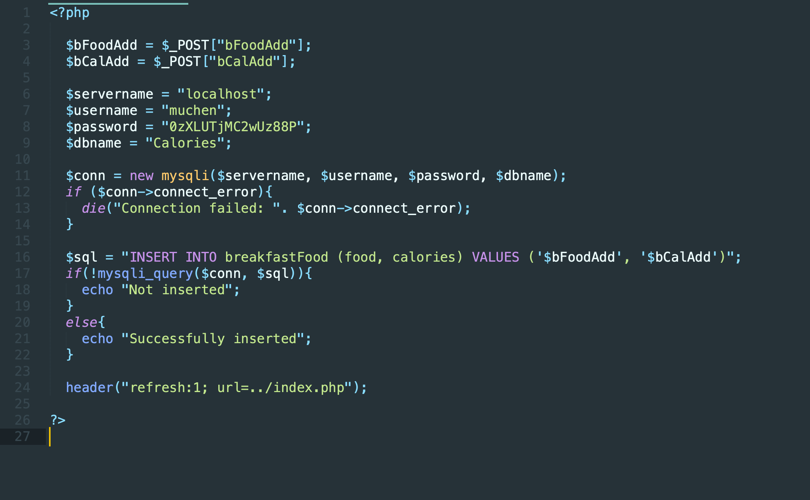
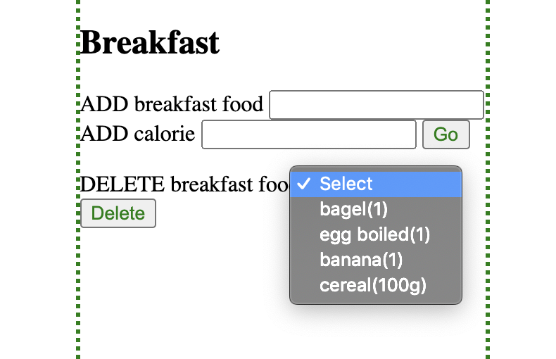
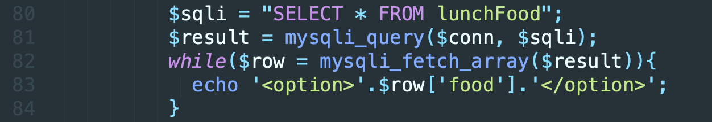
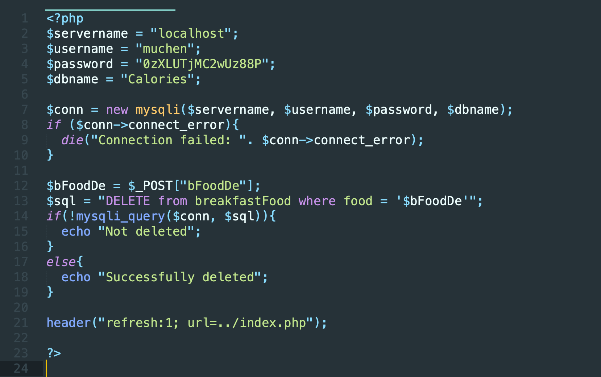
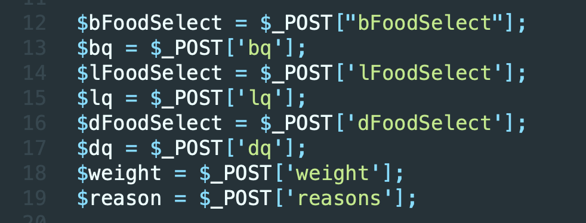
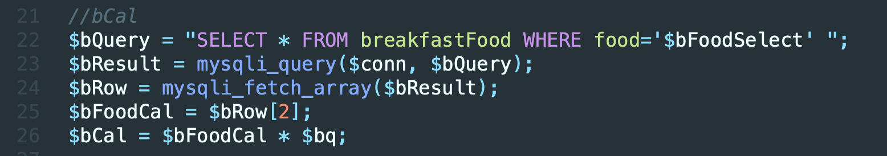
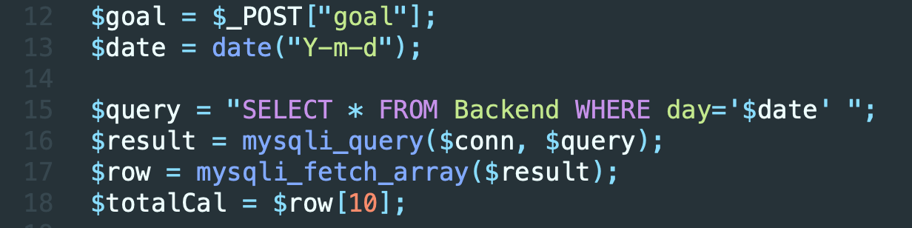
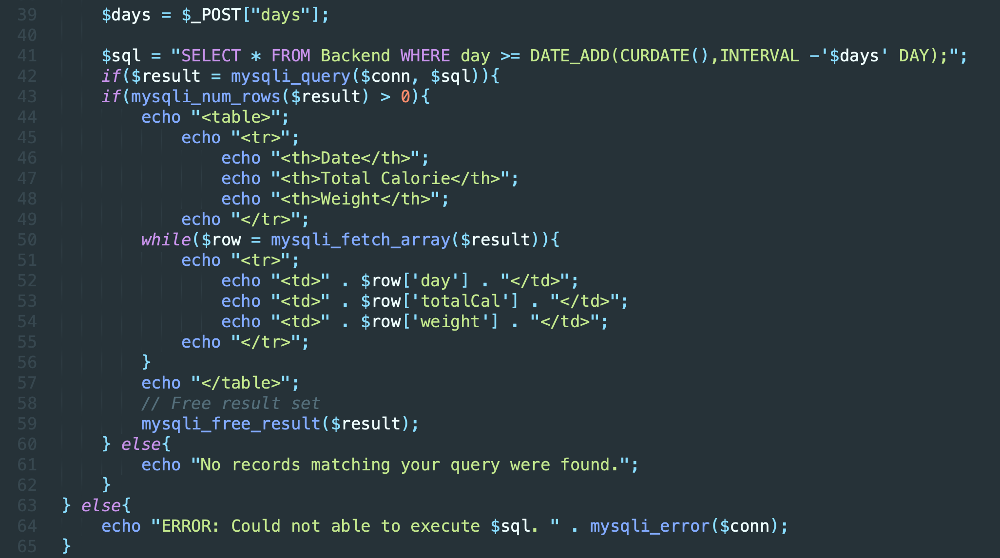
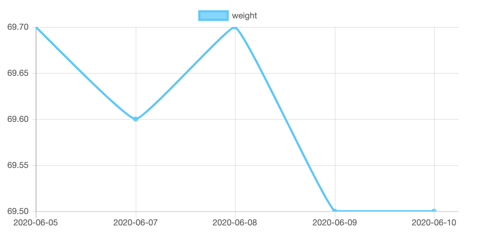

# calorie_counter
Mini IA that I did for my CS class using PHP
# Feature 1: Insert meals

Take the code from insert/insert.php for example:
In lines #2 and #3, I stored the inputs from the user into php variables for later use. 
In lines #6 to #14, connect to database.
And from #16 to #22, I used SQL to communicate with the database to insert the user inputs to a table called “breakfastFood”. This way, the users can then select the meals they’ve added.

# Feature 2: Delete meals

In this part, I echoed out the name of every meal stored in the database in the form of dropdown menus because I want the users to be able to see what food is in their database and then make their choices. The code to achieve this effect is here:

This code is taken from index.php lines 80 to 84. 

I first connected to the database, then selected every field from the table lunchFood, used mysqli_query to send that command to mysql, and used the function fetch_array to loop out every item in the field “food”. This way, I can echo out every item stored in the field “food” and present it as a dropdown menu.

I did the same for breakfast, lunch, and dinner. 

This is the code from delete/deleteB.php (which stands for deleting breakfast food)
The process is generally the same as inserting meals, I used the POST method to store user input into a variable and then delete it from the table. 
# Feature 3: Select meals and quantity
This feature is included in select.php.
For the selection of daily meals, I included fields like date, breakfastmeal, bquantity, breakfastCal, lunchmeal, lquantity, lunchCal, dinnermeal, dquantity, dinnerCal, totalCal, reason, and weight in a table called “Backend”. I first created an html form in selectPage.php with dropdown menus, input texts, and input numbers. 

I then extracted all user inputs through the POST method and stored them in php variables here:

However, the process of getting for example, breakfastCal is pretty challenging because I have to find the corresponding calories for the meal that the user has selected and multiply it with the quantity. 

To find breakfastCal, I first identified the row that the selected breakfast meal is in. Then I used the fetch_array function to compile the row into an array, with the calorie count being the 2nd element in the array. After getting the calorie for the selected meal, multiply it with the quantity and get breakfastCal. (code below)

TotalCal is calculated by adding breakfastCal, lunchCal, and dinnerCal. 
I then used an insert command to insert all the variables into the table “Backend”.
# Feature 4: Add goal and give feedback on above/below goal

Here I took out the totalCal of the day and compared it with the goal that the user imputed into the goal form. If totalCal is greater than goal, echo out the totalCal in red; if less than goal, echo out totalCal in green. 

# Feature 5: Allow users to add reason and weight
I accomplished this goal by including a dropdown menu with reasons like holidays or being sick in it. I also included a text field that allows two decimal places for logging in weight. 

# Feature 6: Allow users to see their past 1/3/7/10/30 days of meal
This is included in resultPage.php

Here I first figured out how many days of data the user wanted to see from the dropdown menu, then subtracted the number of days from the current day and echoed out the date, totalCal, and weight for those selected days in a table. If the user wants to have a more visualized presentation of their weight change, they can click on the “view graph” and the button will take them to Feature 7.
# Feature 7: visualized graph of weight change
I used javascript with jQuery to generate the graph. I first selected the day and weight from the table “Backend” using PHP and stored these as js data in chartjs/js/linegraph.js.
Javascript will then create a graph with dates as the x-axis and weight as the y-axis. The users will have a more visual effect of their weight-loss journey and will be more likely to stick to the plan once they see improvements. 

